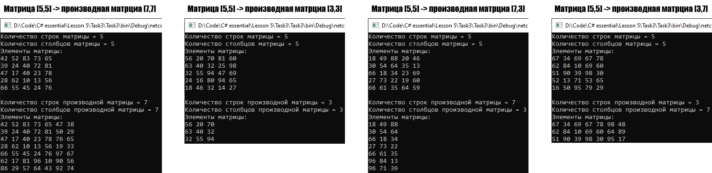

# Lesson5_task3
Условия задачки:
>Используя Visual Studio, создайте проект по шаблону Console Application.  
Требуется:  
Создать класс MyMatrix, обеспечивающий представление матрицы произвольного размера 
с возможностью изменения числа строк и столбцов.  
Написать программу, которая выводит на экран матрицу и производные от нее матрицы разных порядков. 

Подытог: вот такенный майндфак на выходе
>

